### Setting Up Model in Maya

[previous](../case-study-material/README.md#user-content-case-study---the-material) • [home](../README.md#user-content-ue4-static-meshes) • [next](../)

Now lets look at how we export models from **Maya** (the same rules will apply for other 3-D software).  It is best to load it up first in modeling software and adjust scale to match Unreal's. We will use the same technique that we did in Unreal by importing a scale character model into Maya to scale our objects to the correct size."

 

---

| `required.software`\|`Static Meshes`| 
| :--- |
| :floppy_disk: If you have not already installed **[Maya](https://www.autodesk.com/education/edu-software/overview?sorting=featured&page=1)**, please do so now. The student version is available free of charge and works on mac and pc.|

##### `Step 1.`\|`SUU&G`|:small_blue_diamond:

Open up Maya (after you installed the free student version). First we want to make sure the scale in the modelling software's unit is set to 1 unit is 1 centimeter (cm).  In Maya this can be set in **Windows | Settings/Preferences | Preferences**.

##### `Step 2.`\|`FHIU`|:small_blue_diamond: :small_blue_diamond: 

Select the **Settings** tab and make sure the **Working Units** is set to **centimeter**.  You can keep the units as **Y** up as this can be flipped on the export or import into UE4.  It may be best to stay in the native coordinate system to the software being used. Press the <kbd>Save</kbd> button to lock in this change.

##### `Step 3.`\|`SUU&G`|:small_blue_diamond: :small_blue_diamond: :small_blue_diamond:

Unreal's grid defaults to one meter square and 10 subdivisions. Lets make the ground plane grid the same as UE4.  Each grid piece is `10` units.  So in Maya go to **Display** and **Grid** and press the settings square. Set the size of the grid to be 4 x 5 meter sections.  Since a unit is a **cm** set the **Length and width:** and set it to `500.0` units.  We want a 1 meter grid so that is a 100cm.  SEt the **Grid lines every:** `100.0` units.  Set the **Subdivions:** to `10`.  Set custom colors so you can see the difference between the axis, grid and subdivisions (they all default to the same color)l

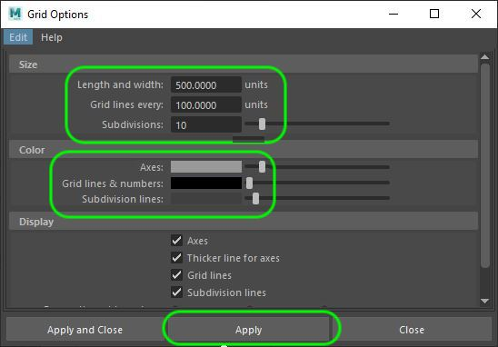

##### `Step 4.`\|`SUU&G`|:small_blue_diamond: :small_blue_diamond: :small_blue_diamond: :small_blue_diamond:
Now we should have grid lines that match Unreal's.

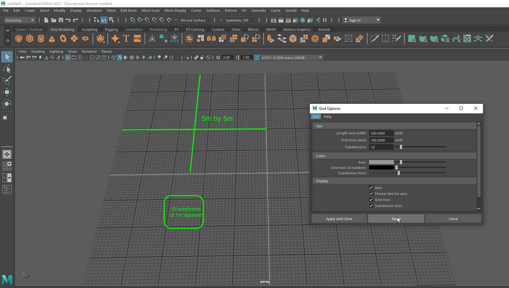

##### `Step 5.`\|`SUU&G`| :small_orange_diamond:

In your modelling scene use a reference object to eyeball scale.  Using a to scale human model in the scene you will not export can help (or scaled reference of what you are trying to model).",

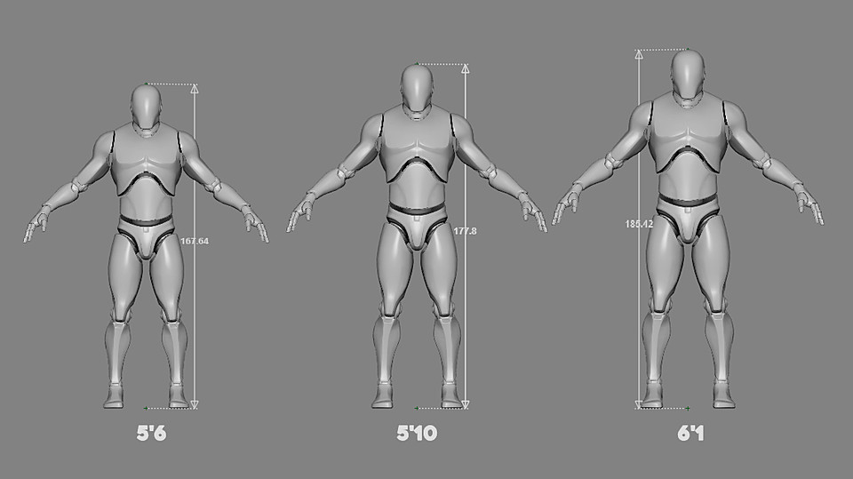

##### `Step 6.`\|`SUU&G`| :small_orange_diamond: :small_blue_diamond:

If you still have the downloaded mannequin model that you used in Unreal you can skip this step.  Otherwise, you download the exact same [Mannequin model](../Assets/SM_UE4Mannequin.fbx).  This way you can bring it into your scene to check scale. Drag it into the modeling window in Maya. Press the **Outlinjer** button in the bottom left corner and select the **SK_Mannequin** model.  I also set all translations to `0`.

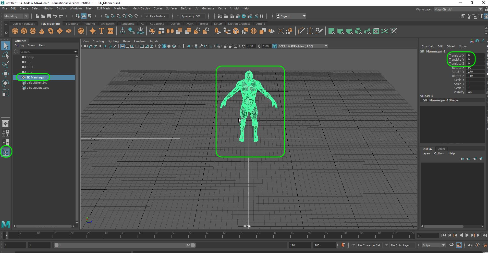

##### `Step 7.`\|`SUU&G`| :small_orange_diamond: :small_blue_diamond: :small_blue_diamond:

Now you can use this reference game model in UE4 and your modeling software.  We can confirm that the character is the same size relative to the grid that we have set up to the same dimensions.  This can also be replicated in other 3-D software packages.

Now if you game is about insects or giant monsters you might want to use a different object to use to base your scale on.

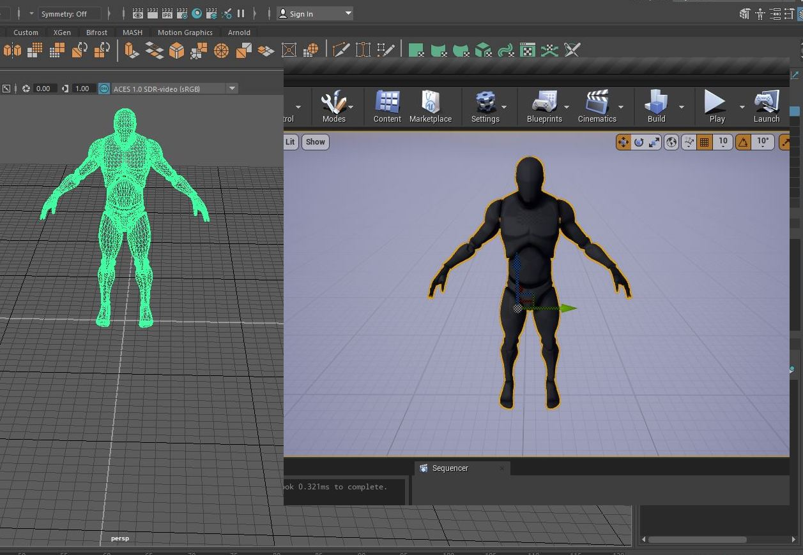

##### `Step 8.`\|`SUU&G`| :small_orange_diamond: :small_blue_diamond: :small_blue_diamond: :small_blue_diamond:

A [UV map](https://en.wikipedia.org/wiki/UV_mapping) is the process of projecting a two dimensional texture onto a 3-D object.  Imagine the model unwrapped into a 2-Dimensional space.  Each group of pixels is mapped to a face on the object.  Here is what a simple cube might look like.

##### `Step 9.`\|`SUU&G`| :small_orange_diamond: :small_blue_diamond: :small_blue_diamond: :small_blue_diamond: :small_blue_diamond:

The **U** is the X axis in the scene and the **V** is the Y axis.  It is a normalized range between `0` and `1` as it can work with a texture of any size.  Please note that the aspect ratio is square.  So most texture maps that are used will be square (unless the UV map is stretched on an axis).  In fact in **Unreal** all textures have to be square to render properly otherwise they will not be [mip-mapped](https://en.wikipedia.org/wiki/Mipmap).

##### `Step 10.`\|`SUU&G`| :large_blue_diamond:

Open up **Maya** with the reference mannequin and download the [SM_Bathtub.FBX](../Assets/SM_Bathtub.FBX) and drag the file into Maya to open it. Click on the <kbd>Outliner</kbd> button to see the meshes in the scene file.  Select **SM_Bathtub** and `0` out the translations.

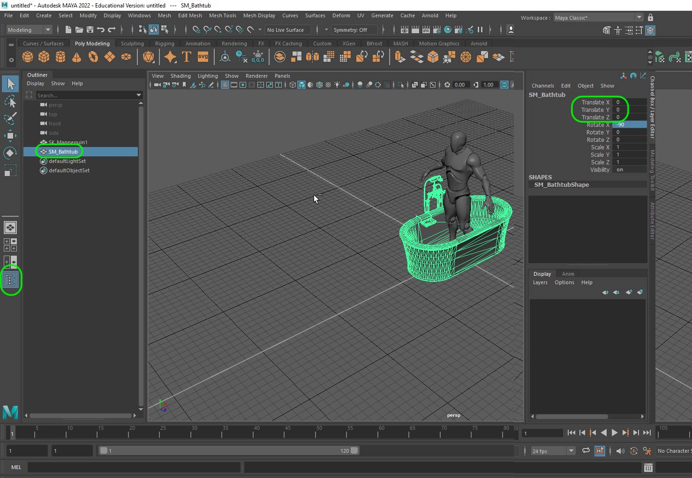

##### `Step 11.`\|`SUU&G`| :large_blue_diamond: :small_blue_diamond: 

Once we are happy with the scale we can hide the model we don't want to see that is not part of the scene.  Select the mannequin model and press the <kbd>cntrl H</kbd> keys to hide.  To show it you can select it again at any time in the **Outliner** and press <kbd>shift H</kbd> to show it again.

##### `Step 12.`\|`SUU&G`| :large_blue_diamond: :small_blue_diamond: :small_blue_diamond: 

Make sure you are in the **Modelling** toolset. 2. Press the UV Editor button.  3. Click on the model to see where the corresponding mesh appears on the model.  You can see that each mesh has a position in the UV Space all normalized between `0` and `1`.

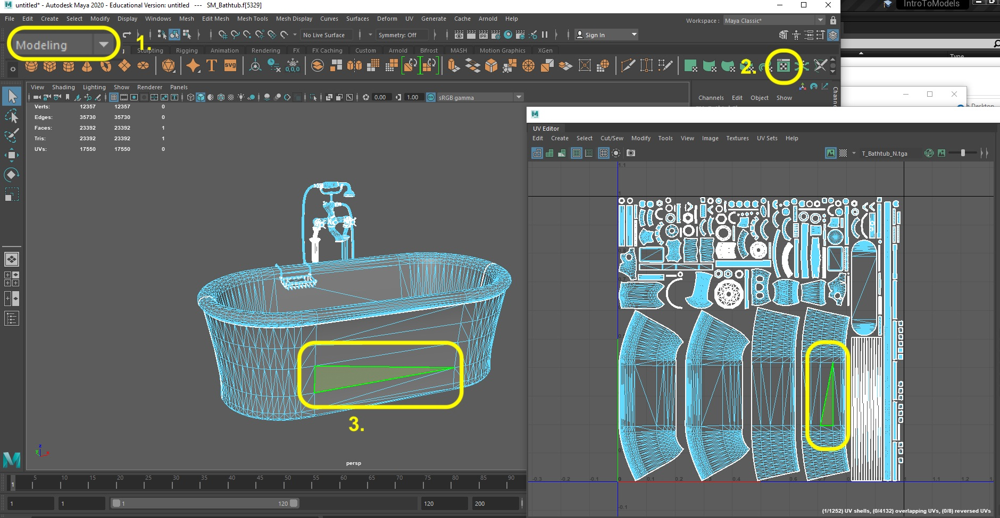

##### `Step 13.`\|`SUU&G`| :large_blue_diamond: :small_blue_diamond: :small_blue_diamond:  :small_blue_diamond: 

You can also preview how a texture will be mapped to see if there is distortion or stretching.  You can press the **Checkerboard** preview button in the **UV Editor**.  Please note this is for previewing only, this will not bake this texture in your model.

##### `Step 14.`\|`SUU&G`| :large_blue_diamond: :small_blue_diamond: :small_blue_diamond: :small_blue_diamond:  :small_blue_diamond: 

"Now you can look to see how this grid in your **UV Editor** is mapped to the object.  Notice that the checkerboard pattern is not distorted and projects nicely to the 3-D model.

https://user-images.githubusercontent.com/5504953/129721909-dd22455c-8d91-4364-8f1e-6f0e4c0acff9.mp4

##### `Step 15.`\|`SUU&G`| :large_blue_diamond: :small_orange_diamond: 

Now a model can use more than one **UV** channel and they are used for more than texture mapping.  In Unity & Unreal games, they use a second **UV** channel to bake their lighting to.  This allows Unreal to display fast shadows without having to calculate their lighting in real time.  The rule of thumb is to leave the second UV channel (UV 1) in Maya empty and let the importer deal with this second channel.  More space needs to be given between UV's to stop light bleeding from one part of the model to another.  So the space is not as well optimized for textures. 

The three main reasons you would not use Unreal to automatically create them is if there are any unwrapped UV's, overlapping UV's or UV's outside the 0 to 1 space.  All of these can be OK for texturing but will cause UV to thrown an error when you build lighting with this model.

In this case we have a UV1 channel so lets delete it and see if Unreal creates a usable light uv map.

For more information about UV Lightmaps to to **[Unwrapping UVs for Lightmaps](https://docs.unrealengine.com/4.26/en-US/WorkingWithContent/Types/StaticMeshes/LightmapUnwrapping/)**.

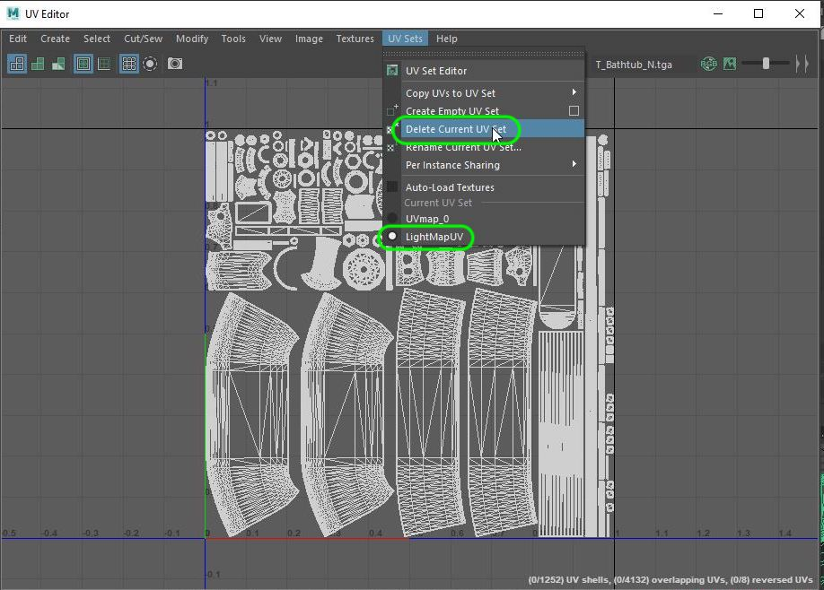

##### `Step 16.`\|`SUU&G`| :large_blue_diamond: :small_orange_diamond:   :small_blue_diamond: 

Once I am happy with the model in Maya I can select the Bathtub model and go to **File | Game Exporter** and make sure you are only exporting the selected object and not the hidden mannequin by setting **Export Selection**.  Make sure the FBX set to FBX 2018 ASCII version to export the model. We prefer ACII (text) to binaries as it plays better with source control like GitHub.  It is a bit larger but easier to handle merge conflicts (you'll see).

Also, we don't want to export the entire scene with the mannequin in it so we select `Export Selection` and make sure we have the **Bathtub** selected in the **Outliner**.  Turn **Smoothing Groups** to `true`.  Make sure that **Maya** does the triangulation as it might do a better job than Unreal.  This is in their pipeline preferences to let the 3-D package triangulate the quads.  Then you need to pick a **Path** (I used my desktop) and name it `SM_Bathtub`.

Press the <kbd>Export</kbd> button.

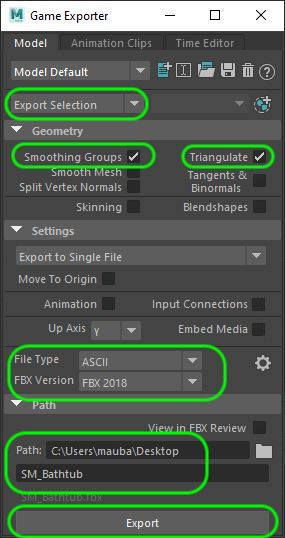

##### `Step 17.`\|`SUU&G`| :large_blue_diamond: :small_orange_diamond: :small_blue_diamond: :small_blue_diamond:

Drag and drop this newly exported **SM_Bathtub** into Unreal.  We turn off the **Skeletal Mesh** option, generate the **Missing Collision** as there is not a collision model provided in Maya.  We will **Generate Lightmap UV's** and see how they differ from the texture UV channel 0.  We will not create a material for the bathtub.

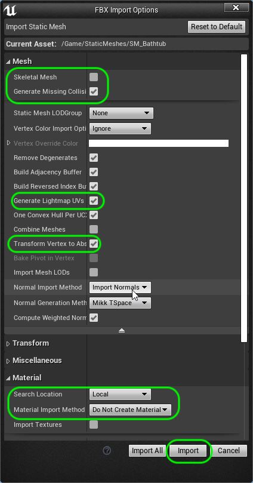

##### `Step 18.`\|`SUU&G`| :large_blue_diamond: :small_orange_diamond: :small_blue_diamond: :small_blue_diamond: :small_blue_diamond:

Lets look at the model in Unreal. Double click on **SM_Bathtub** and click on **Collision | Simple Collision**.  Now Unreal's automatic importer does not deal well with convex shapes so the player cannot enter the bathtub.  We could either model a simple geometry and would work for gameplay or press **Collision | Auto Convex Collision** and play with the **Hull Count** and **Max Hull Verts** and press the <kbd>Apply</kbd> button.  Now this doesn't produce great results and if this was a core gameplay element I would go back to **Maya** and build a better fitting more optimized model for this prop.

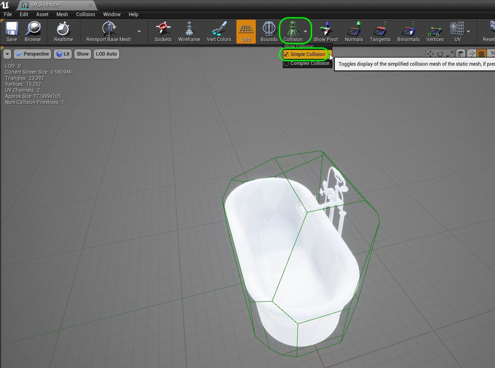
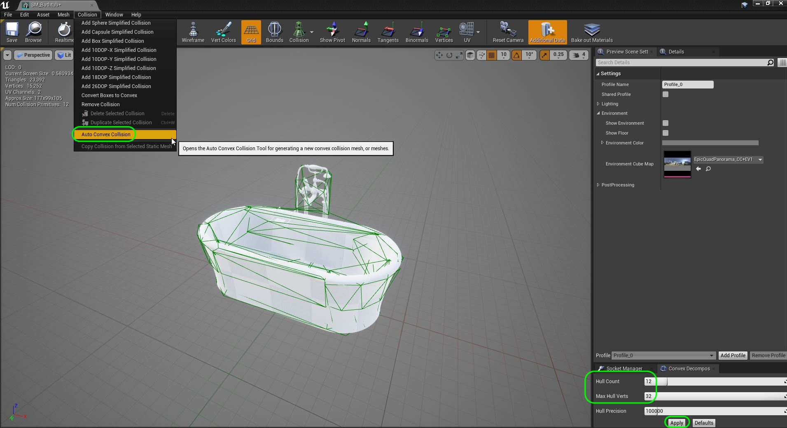

##### `Step 19.`\|`SUU&G`| :large_blue_diamond: :small_orange_diamond: :small_blue_diamond: :small_blue_diamond: :small_blue_diamond: :small_blue_diamond:

Now lets look at UV channel 0 and 1.  The **0** channel is the same as we saw in **Maya** which is the UV layout for textures.  Notice how it changed the spacing in UV  layout **1** for the lightmap UV's to give more distance between surfaces to mitigate light bleeding from one unrelated part of the model to another.  It looks like it did a good job and we will not have to adjust it.

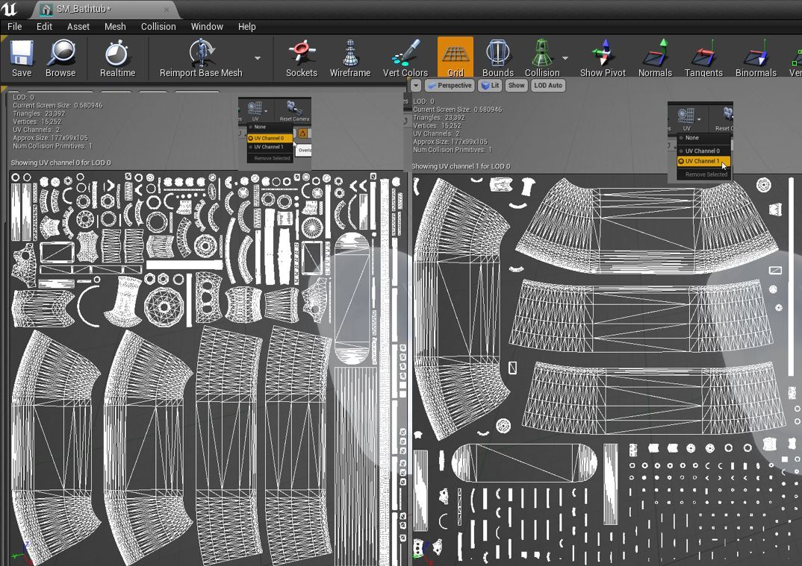

##### `Step 20.`\|`SUU&G`| :large_blue_diamond: :large_blue_diamond:

Now drag a copy of the **SM_Bathtub** into the game scene.  Take a look at it to make sure it is ok.

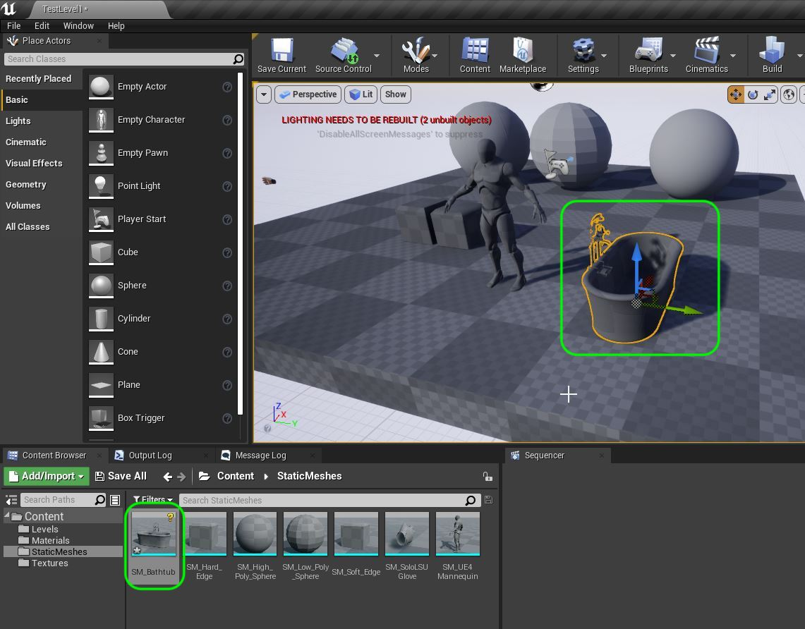

##### `Step 21.`\|`SUU&G`| :large_blue_diamond: :large_blue_diamond: :small_blue_diamond:

___

| [previous](../case-study-material/README.md#user-content-case-study---the-material)| [home](../README.md#user-content-ue4-static-meshes) | [next](../)|
|---|---|---|
