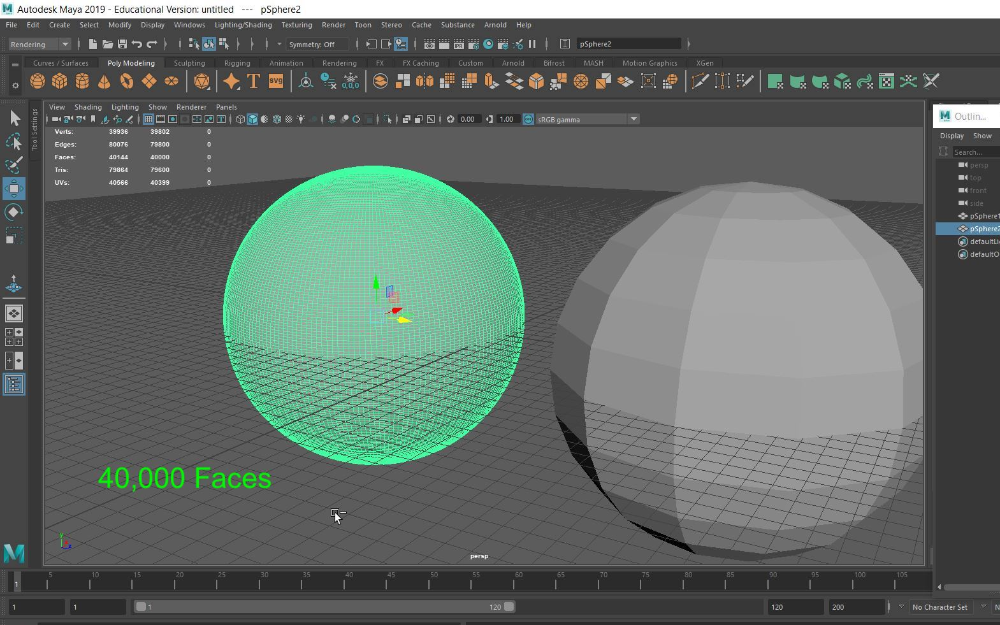
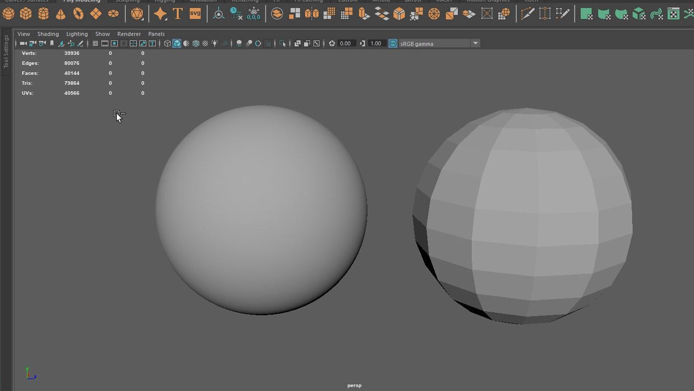
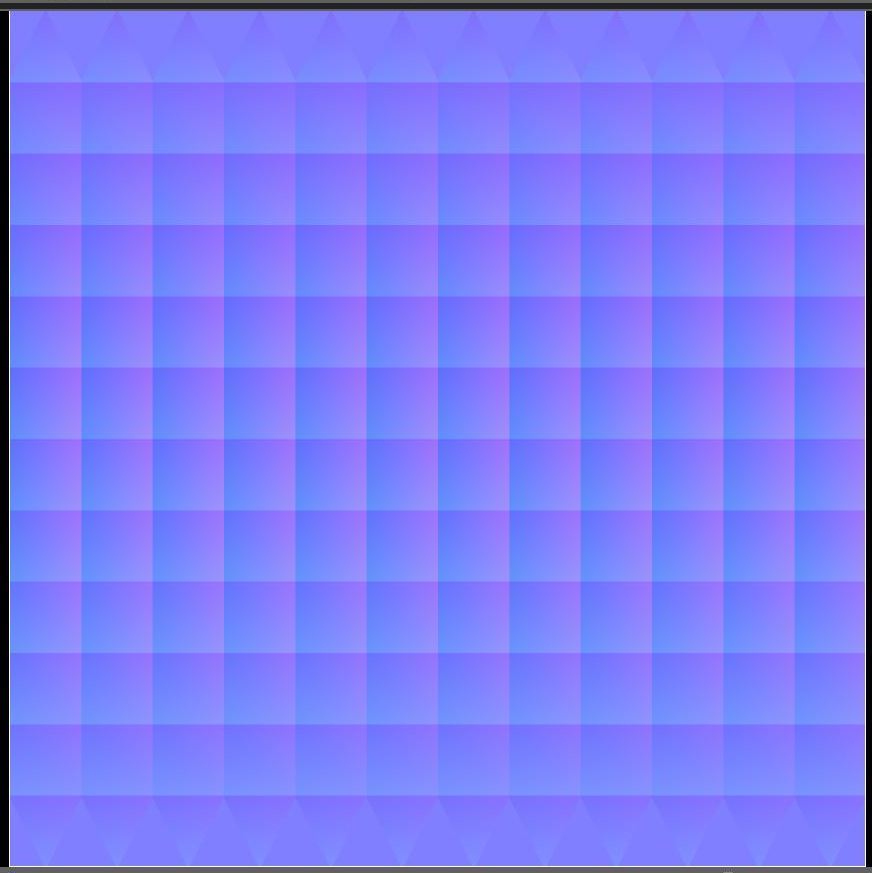
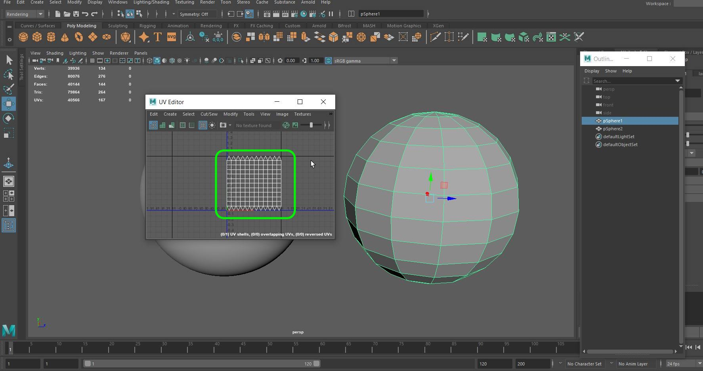
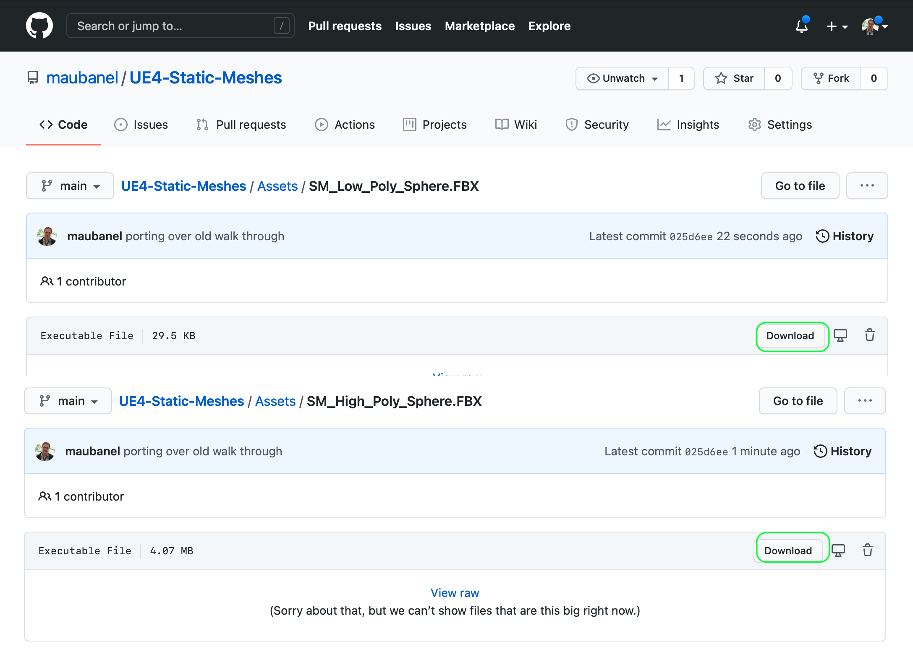
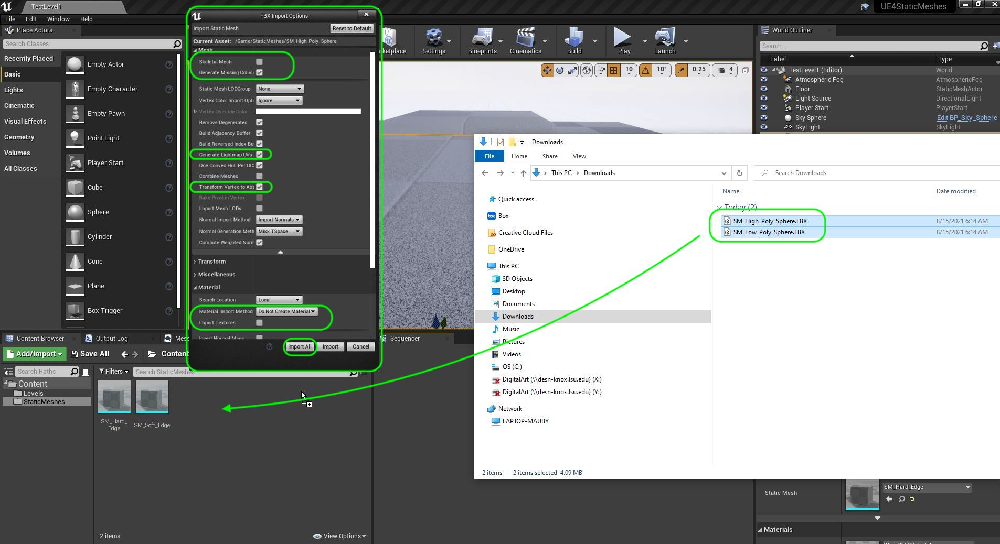
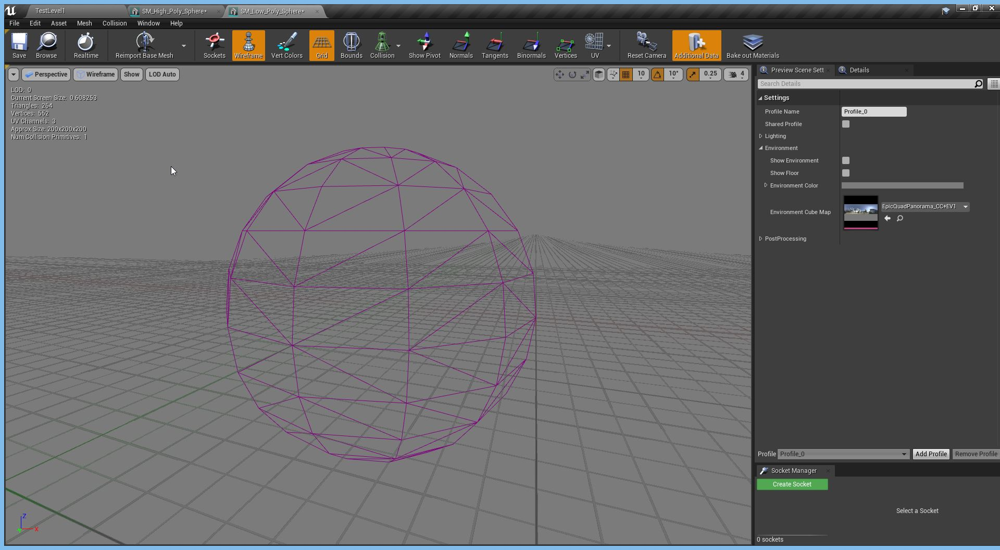
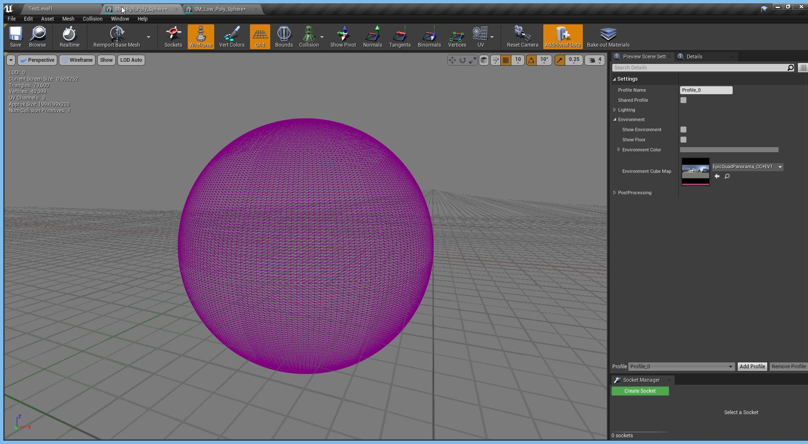
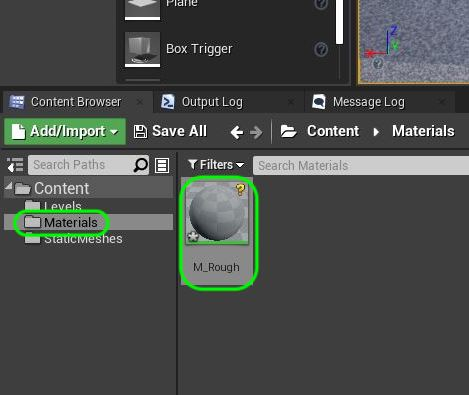
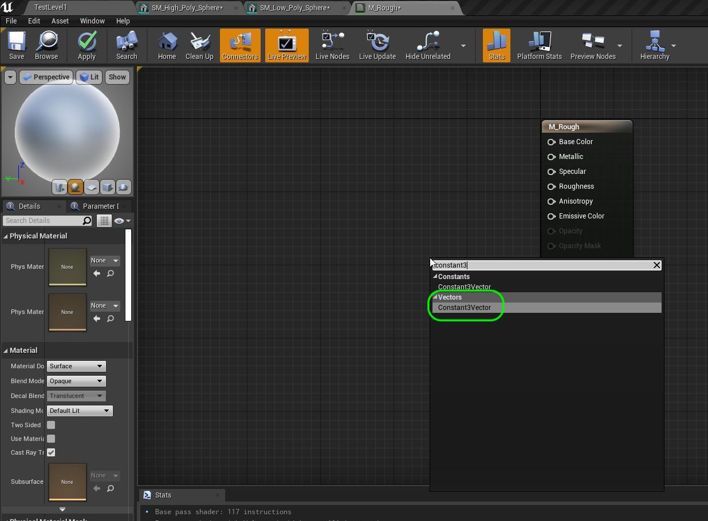

### Normal Maps

[previous](../edge-normals/README.md#user-content-edge-normals-in-practice) • [home](../README.md#user-content-ue4-static-meshes) • [next](../)

Now as you can see we can add detail by manipulating normals.  We can do the same thing by manipulating face normals using **[normal maps](https://en.wikipedia.org/wiki/Normal_mapping)**. This is a texture amp that instead of representing the color of the pixel, represents the angle of the light refracting from the surface. To learn a bit more about normal maps check out this [video](https://www.youtube.com/watch?v=GyfVQmoFX4c).

 

---

##### `Step 1.`\|`SUU&G`|:small_blue_diamond:
There is another way of simulating geometric details that are not in the base model.  Lets look at these two objects.  Here is a low poly sphere with 144 faces. Notice that **Maya** is representing the faces as quads.

##### `Step 2.`\|`FHIU`|:small_blue_diamond: :small_blue_diamond: 

The faces are so small that the ball looks perfectly round. So we see we have one model that is much smaller (and therefore faster in the engine) than the other, but one contains far more vertices than the other.

##### `Step 3.`\|`SUU&G`|:small_blue_diamond: :small_blue_diamond: :small_blue_diamond:

Just like we can control the normals on an edge to change how light reacts to it.  We can also adjust normals along the face to produce the same effect.  What we can do though is grab the normal's from the high poly spheres and use those normals to shade our low poly model. This is done by saving them as a texture as opposed to geometry.  What the **RGB** channel holds is **XYZ** data of a [vector](https://en.wikipedia.org/wiki/Euclidean_vector).  This uses the face normal on the high polygon model and encodes it in a pixel on a texture map.  The texture normal map of this sphere looks like this. For a deeper dive take a look at this [CG Video](https://www.youtube.com/watch?v=oOOeV3IU2Yo). here is a normal map created from the high poly sphere.

##### `Step 4.`\|`SUU&G`|:small_blue_diamond: :small_blue_diamond: :small_blue_diamond: :small_blue_diamond:

This texture matches the UV coordinates of the low poly sphere.

##### `Step 5.`\|`SUU&G`| :small_orange_diamond:

A [UV](https://en.wikipedia.org/wiki/UV_mapping) is a texture map that assigns pixels in the image to a face on the model. So this is what a sphere would look like with a map texture applied to the UVs. A UV map is an unwrapped 2-D version of a 3-D Model.  This allows the renderer to know what pixel on the texture in the uv map gets placed where in the model (which is 3-D). For a quick 2 minute dive checkout this [video](https://www.youtube.com/watch?v=mAcEzlsoad0).
    

##### `Step 6.`\|`SUU&G`| :small_orange_diamond: :small_blue_diamond:

Download [SM_Low_Poly_Sphere.FBX](../Assets/SM_Low_Poly_Sphere.FBX) and [SM_High_Poly_Sphere.FBX](../Assets/SM_High_Poly_Sphere.FBX). These are the two models shown above.

##### `Step 7.`\|`SUU&G`| :small_orange_diamond: :small_blue_diamond: :small_blue_diamond:

Drag them into the the **StaticMeshes** folder and lets keep the same import settings.  It is a static mesh and not a skeletal one, we need to generate collisions as I did not do this in the model, we need to generate lightmap uv's as I did not do this, we keep **Transform Vertext to Absolute** as `true`and change the import setting of **Material Import Method** to `Do Not Create Material` and turn off **Import Textures**.  Press the <kbd>Import All</kbd> button.  

##### `Step 8.`\|`SUU&G`| :small_orange_diamond: :small_blue_diamond: :small_blue_diamond: :small_blue_diamond:

Double click **SM_Low_Poly_Sphere** folder, turn off .  Turn on **Wireframe** to get a better view of the geometric topology. Notice that it has 552 vertices. Make sure the **Show Environment** and **Show Floor** are false.  You can see the faces are large and up close this does not look like a sphere and you can clearly see the faces.

##### `Step 9.`\|`SUU&G`| :small_orange_diamond: :small_blue_diamond: :small_blue_diamond: :small_blue_diamond: :small_blue_diamond:

Open up **SM_High_Poly** mesh by double clicking on it.  Notice that is uses 40,399 vertices. Now the faces are so small that it retains the shape of a sphere and you do not notice the faces. These were both generated from the model we saw above in Maya.

##### `Step 10.`\|`SUU&G`| :large_blue_diamond:

Add a folder called `Materials`.  Right click and add a new **Material** and call it `M_Rough`.

##### `Step 11.`\|`SUU&G`| :large_blue_diamond: :small_blue_diamond: 

Open the material and either left mouse click while pressing the <kbd>3</kbd> key, or right click on the graph and select a `vector3constant`.  This represents three floats (that we will be using for the **RGB** channels).

##### `Step 12.`\|`SUU&G`| :large_blue_diamond: :small_blue_diamond: :small_blue_diamond: 

##### `Step 13.`\|`SUU&G`| :large_blue_diamond: :small_blue_diamond: :small_blue_diamond:  :small_blue_diamond: 

##### `Step 14.`\|`SUU&G`| :large_blue_diamond: :small_blue_diamond: :small_blue_diamond: :small_blue_diamond:  :small_blue_diamond: 

##### `Step 15.`\|`SUU&G`| :large_blue_diamond: :small_orange_diamond: 

##### `Step 16.`\|`SUU&G`| :large_blue_diamond: :small_orange_diamond:   :small_blue_diamond: 

##### `Step 17.`\|`SUU&G`| :large_blue_diamond: :small_orange_diamond: :small_blue_diamond: :small_blue_diamond:

##### `Step 18.`\|`SUU&G`| :large_blue_diamond: :small_orange_diamond: :small_blue_diamond: :small_blue_diamond: :small_blue_diamond:
Download [T_Sphere_N.tga](../Assets/T_Sphere_N.tga) 

##### `Step 19.`\|`SUU&G`| :large_blue_diamond: :small_orange_diamond: :small_blue_diamond: :small_blue_diamond: :small_blue_diamond: :small_blue_diamond:

##### `Step 20.`\|`SUU&G`| :large_blue_diamond: :large_blue_diamond:

##### `Step 21.`\|`SUU&G`| :large_blue_diamond: :large_blue_diamond: :small_blue_diamond:

___

| [previous](../edge-normals/README.md#user-content-edge-normals-in-practice)| [home](../README.md#user-content-ue4-static-meshes) | [next](../)|
|---|---|---|
