### Setting Up

<sub>[home](../README.md#user-content-ue4-static-meshes) • [next](../)</sub>


We will be working in a third person template and will use the UE4 default and alter it for our needs.  This will give us all we need for a character that we can control."

<br>

---
| `required.software`\|`Hello World`| 
| :--- |
| :floppy_disk:You will need to install the latest version of _UE4 4.26.x_ by downloading the [Epic Games Launcher](https://www.epicgames.com/store/en-US/download). You will also need a [GitHub](https://github.com/) account which is free to sign up for as we will be using version control. You will also need a mac or PC that is powerful enough to run unreal. If you are on a PC you will have to download and install [git](https://git-scm.com/downloads) (on a mac it may prompt you to install git as well but you can do it through the terminal). We will also install [Github Desktop](https://desktop.github.com) as it provides a GUI interface so you don't have to worry about command line. Once git is installed you will also need to download and install the [Git LFS (Large File System)](https://git-lfs.github.com) as well for both PC and mac.  You will also need access to Maya 2020..\n\nLets make sure you can see hidden folders. On the PC follow these [Windows 10 Turn on Hidden Folders](https://support.microsoft.com/en-us/help/4028316/windows-view-hidden-files-and-folders-in-windows-10) directions. On the Mac it is a bit more involved so go and [turn on hidden folders on Mac](https://ianlunn.co.uk/articles/quickly-showhide-hidden-files-mac-os-x-mavericks). |

##### `Step 1.`\|`SUU&G`|:small_blue_diamond:

Run the **Epic Games Launcher** and press either **Launch** button to go to the *Select or Create New Project* screen.

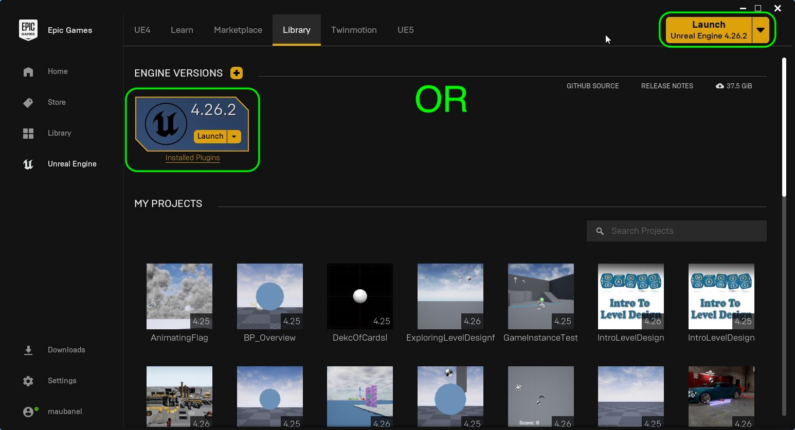


##### `Step 2.`\|`FHIU`|:small_blue_diamond: :small_blue_diamond: 

You can pick from different starting templates with Games, Film/TV, Architecture and Design as options.  Lets start by selecting **Games** and then press the **Next** button.


##### `Step 3.`\|`SUU&G`|:small_blue_diamond: :small_blue_diamond: :small_blue_diamond:

Unreal then allows us to have various starting point template for different genres of games.  Lets select the **Blank** template.

This now takes you to the *Project Settings* screen. The first settings on the top left is set to Blueprints.  You can select between C++ and Blueprint.  Since we will not be doing any C++ programming in this exercise we will leave it with Blueprint.  I am leaving the quality settings to **Maximum Quality** as my computer is powerful enough to handle it.  If you feel your computer is not at a gaming level select a lower quality.  We will leave **Raytracing** off as we will not be using it at the moment.  We set the paltform to **Desktop** as we will be on a PC or Mac playing the game and not on a game console or on mobile.  Then you can load up the project with some basic content and we will **NOT** be loading this  to keep our project file sizes down.

Select a folder to put it in (I suggest `Documents/github/` and then assign a project name and I am calling it `UE4StaticMeshes`.  Press the **Create Project** button to start the new project.",


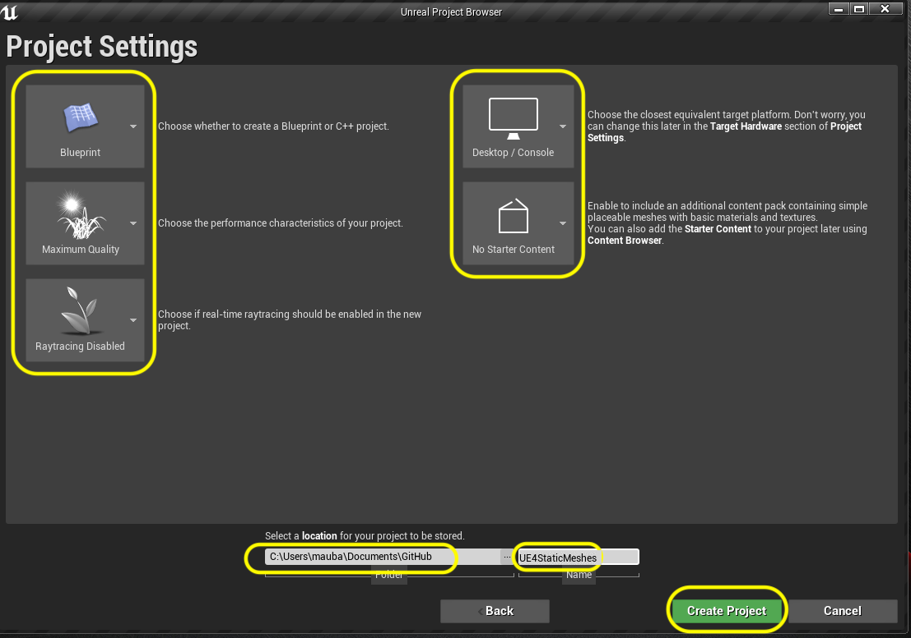


##### `Step 4.`\|`SUU&G`|:small_blue_diamond: :small_blue_diamond: :small_blue_diamond: :small_blue_diamond:

Make sure you have a GitHub account and that you are logged into it. Click on the GitHub Classroom [UE4-Static-Meshes-FA21 Link](https://classroom.github.com/a/W90fu96j). Accept the prompt if it asks you go join the class and you should get to a **Accept the Assignment – UE4-Static-Meshes-FA21**. Press the <kbd>Accept this assignment</kbd> button.

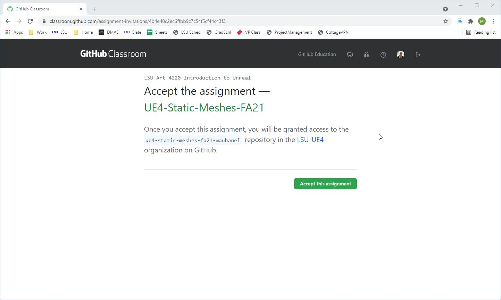


##### `Step 5.`\|`SUU&G`| :small_orange_diamond:

Now navigate to the new **GitHub** project and copy the location of the **repository**.

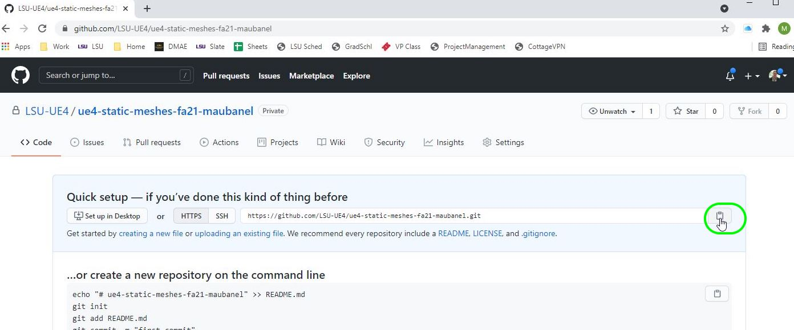


##### `Step 6.`\|`SUU&G`| :small_orange_diamond: :small_blue_diamond:


In the editor select the **Edit** menu item then from the drop down menu select **Editor Preferences**. Select **Loading & Saving** tab from the left hand side.  Go to *Source Control* and set **Prompt for Checkout on Asset Modification** to `true` and **Add New Files when Modified** to `true`.  Leave the other two settings at `false` and accept their default editor to deal with merge conflicts. 

https://user-images.githubusercontent.com/5504953/127741784-aa262ff8-e4be-4973-9bb7-4ce7abbc171b.mp4


##### `Step 7.`\|`SUU&G`| :small_orange_diamond: :small_blue_diamond: :small_blue_diamond:

We will turn this folder into a git repository.  We can do this inside of Unreal.  Click on the **Source Control** button and select **Connect to Source Control**.  This opens up a menu that shows your **Connect to Source Control**.  Then in the menu select **Git (beta version)** as the source control you will be using. Make sure you add a **.gitignore** file, a **README.md** file, a **.gitattributes for Git LFS** file and paste in the GitHub link for the project. Finally **Initialize project with Git** file.

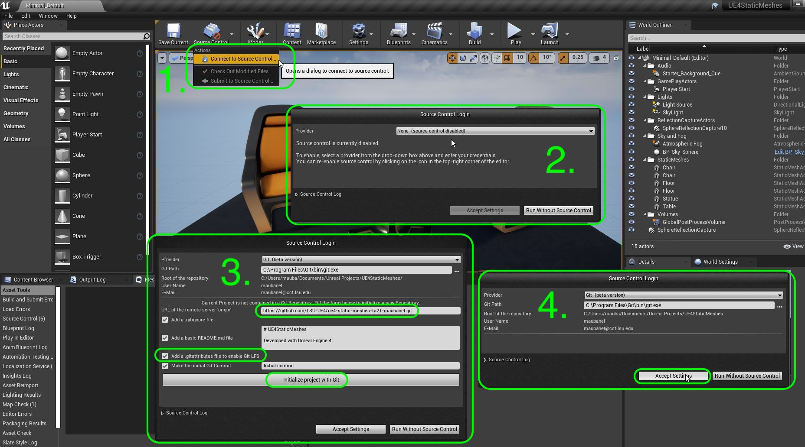


##### `Step 8.`\|`SUU&G`| :small_orange_diamond: :small_blue_diamond: :small_blue_diamond: :small_blue_diamond:

Press the **Source Control** button and select `Submit to Source Control`.  Add a comment about the inital commit and press the <kbd>Submit</kbd> button.

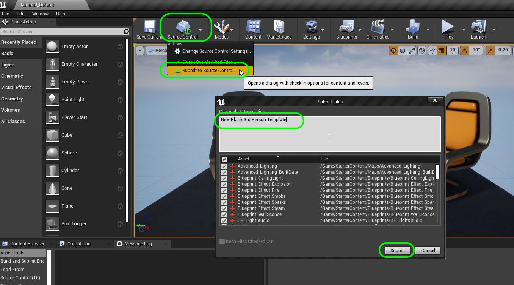


##### `Step 9.`\|`SUU&G`| :small_orange_diamond: :small_blue_diamond: :small_blue_diamond: :small_blue_diamond: :small_blue_diamond:

Now our server has no files on it. We will be using command line (**Terminal** on the mac Or **Git Bash** on the PC). 

In terminal type `git status`.  You will see that it hasn't added files outside of the **Content** folder.  We need to add these seperately. Type 
```
git add .
git commit -m "initial commit"
```

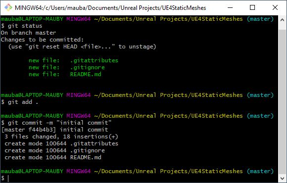


##### `Step 10.`\|`SUU&G`| :large_blue_diamond:
UE4 still defaults to **Master** branch so we will change it to main.  Type:

```
git branch -M main
git push -u origin main
```
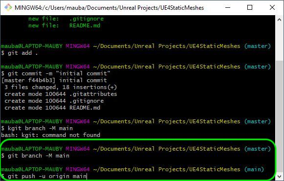


##### `Step 11.`\|`SUU&G`| :large_blue_diamond: :small_blue_diamond: 
Git should return a message saying it has pushed succesfully.  You can also check the github repository to make sure it receive the files.

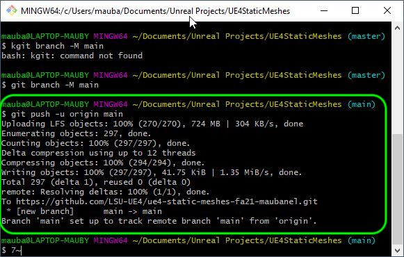


##### `Step 12.`\|`SUU&G`| :large_blue_diamond: :small_blue_diamond: :small_blue_diamond: 

Edit the **README.md** file on GitHub and enter your name as the author and a brief description of the project.  I added `Quick introduction to static meshes (models), preparing them and importing them to Unreal Engine 4`.

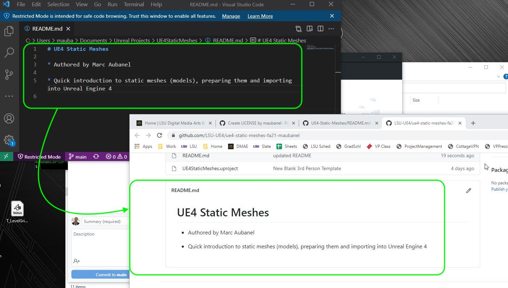


##### `Step 13.`\|`SUU&G`| :large_blue_diamond: :small_blue_diamond: :small_blue_diamond:  :small_blue_diamond: 

Now lets add this new repository to **GitHub Desktop** to make it accessible.  Remember **UE4** will just add and commit in engine you have to use another piece of software to push to the server.

Open up **GitHub Desktop** and select **File | Add local repository...**.  Select the location of this project in the root of the `.git` & `.Content` folders. Press the <kbd>Select Folder</kbd> button.

This brings up the **Add local repository** menu.  Press the <kbd>Add repository</kbd> button.  Now fetch from origin to make sure you have the latest from the server.

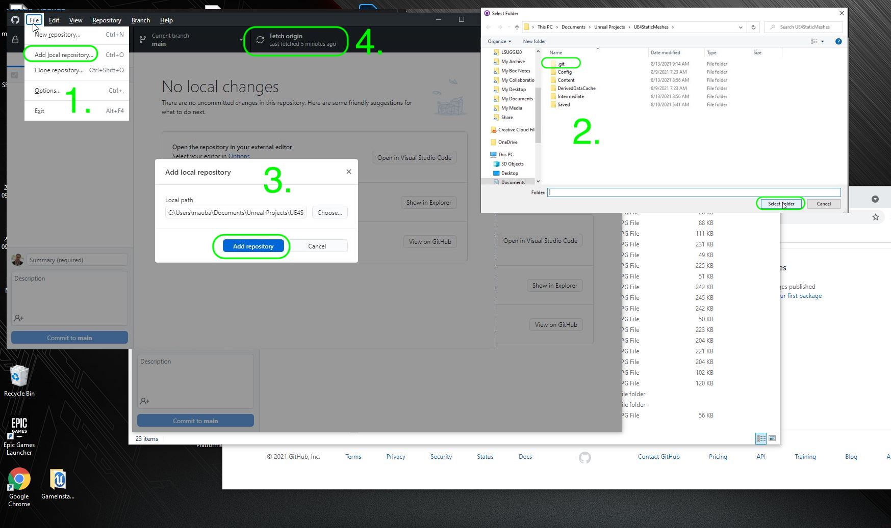


##### `Step 14.`\|`SUU&G`| :large_blue_diamond: :small_blue_diamond: :small_blue_diamond: :small_blue_diamond:  :small_blue_diamond: 

Go to **GitHub** and press the **Add file** button and select **Create new file**. Type in `LICENSE`.  A button pops up on the right and press **Choose a license template**. I recommend the **MIT License**. Add your name and correct the year if necessary. Then you press **Review and submit**. Go back to the main page and select **Compare and pull request**. Press the **Create pull request** button. Select **Merge pull request** and go back to the main page.  The `LICENSE` file should now show up. Now this is on the server so lets bring it onto our laptop.  Go to **GitHub** deskto and press **Fetch Origin** to get the latest.

https://user-images.githubusercontent.com/5504953/129390944-574a4285-d77b-410c-b130-3ce19954814a.mp4


##### `Step 15.`\|`SUU&G`| :large_blue_diamond: :small_orange_diamond: 
Download a thumbnail that you can use on this project [Intro Thumbnail](../../Assets/IntroToModels.png). Press the **Settings** button and select **Project Settings**.  Make sure you are in the **Project Description** tab and press the three dots in the **About** tab next to the thumbnail and attach the thumbnail you just downloaded. Enter a **Description**, **Project Name**.  Put your name as the **Publisher | Company Name** and you can add your email in **Support Contact**. Add the **Project Displayed Title** and **Project Debug Title Info**.",

Add a new folder to the **Content Browser**, call this folder `Levels`. Go to **File | Save Current** and call the level `TestLevel1` and save it in the **Maps** folder. Go to **Settings | Project Settings** and select the **Maps and Modes** tab.  Change the **Editor Startup Map** and **Editor Default Map** to `Test Level 1`. Close the **Project Settings** window and save again.  Press **Source Control | Submit to Source Control** and type in a message of what you just did.  Press **Submit** and you have now succesfully saved the changes locally.


##### `Step 16.`\|`SUU&G`| :large_blue_diamond: :small_orange_diamond:   :small_blue_diamond: 


##### `Step 17.`\|`SUU&G`| :large_blue_diamond: :small_orange_diamond: :small_blue_diamond: :small_blue_diamond:


##### `Step 18.`\|`SUU&G`| :large_blue_diamond: :small_orange_diamond: :small_blue_diamond: :small_blue_diamond: :small_blue_diamond:


##### `Step 19.`\|`SUU&G`| :large_blue_diamond: :small_orange_diamond: :small_blue_diamond: :small_blue_diamond: :small_blue_diamond: :small_blue_diamond:


##### `Step 20.`\|`SUU&G`| :large_blue_diamond: :large_blue_diamond:


##### `Step 21.`\|`SUU&G`| :large_blue_diamond: :large_blue_diamond: :small_blue_diamond:


___


| [previous](../)| [home](../README.md#user-content-ue4-static-meshes) | [next](../)|
|---|---|---|
